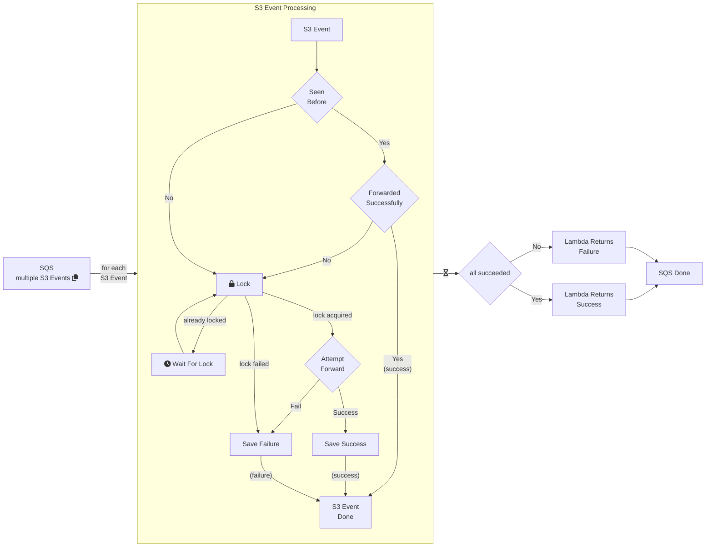

# S3 Deduplication Lambda

This lambda deduplicates S3 messages.

## File Event Processing



## building

Set the following variables before continuing:

```bash
export aws_region=us-west-2
export aws_acct=9XX9
export s3dedup_image_name=your-prefix/s3-event-deduplicator
export s3dedup_version=v5

```

### build docker image

```bash
uv lock
docker buildx build --platform linux/amd64 --provenance=false -t s3-event-deduplicator:${s3dedup_version} .
```

### Push image to ECR

Note: this assume docker is logged into the ECR. If not, see the "log docker into ECR" section below.

```bash
# tag for upload
docker tag s3-event-deduplicator:${s3dedup_version} ${aws_acct}.dkr.ecr.${aws_region}.amazonaws.com/${s3dedup_image_name}:${s3dedup_version}
# push to ECR:
docker push ${aws_acct}.dkr.ecr.${aws_region}.amazonaws.com/${s3dedup_image_name}:${s3dedup_version}
echo uploaded ${s3dedup_image_name} to ${aws_acct}.dkr.ecr.${aws_region}.amazonaws.com/${s3dedup_image_name}:${s3dedup_version}
```

### log docker into ECR

```bash
aws ecr get-login-password --region ${aws_region} | docker login --username AWS --password-stdin ${aws_acct}$.dkr.ecr.${aws_region}.amazonaws.com
```
